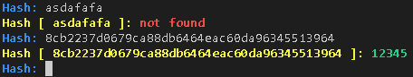

# Find sha1 Decrypted Value With Brute Force

## Requirements
- [**Golang**](https://go.dev)

## Running
```bash
    go run main.go -f="common_passwords.txt"
```

## Build
```bash
    # Linux
    go build -o sha1-brute-force-decrypt

    # Windows
    go build -o sha1-brute-force-decrypt.exe
```

## Example
